# TeacherOS — User Flow Diagrams

## Flow 1: Authentication & Onboarding

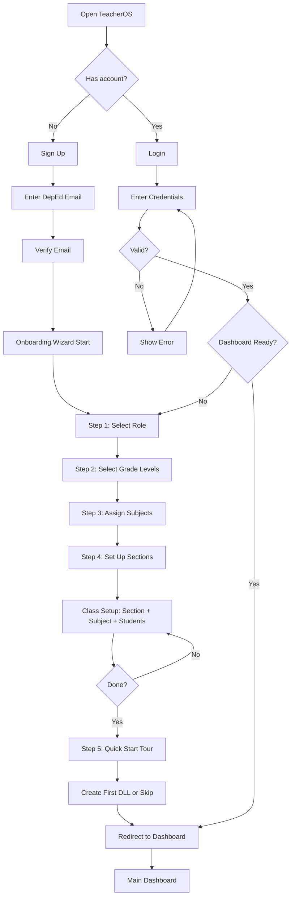

## Flow 2: Daily Dashboard → Workflow Launch

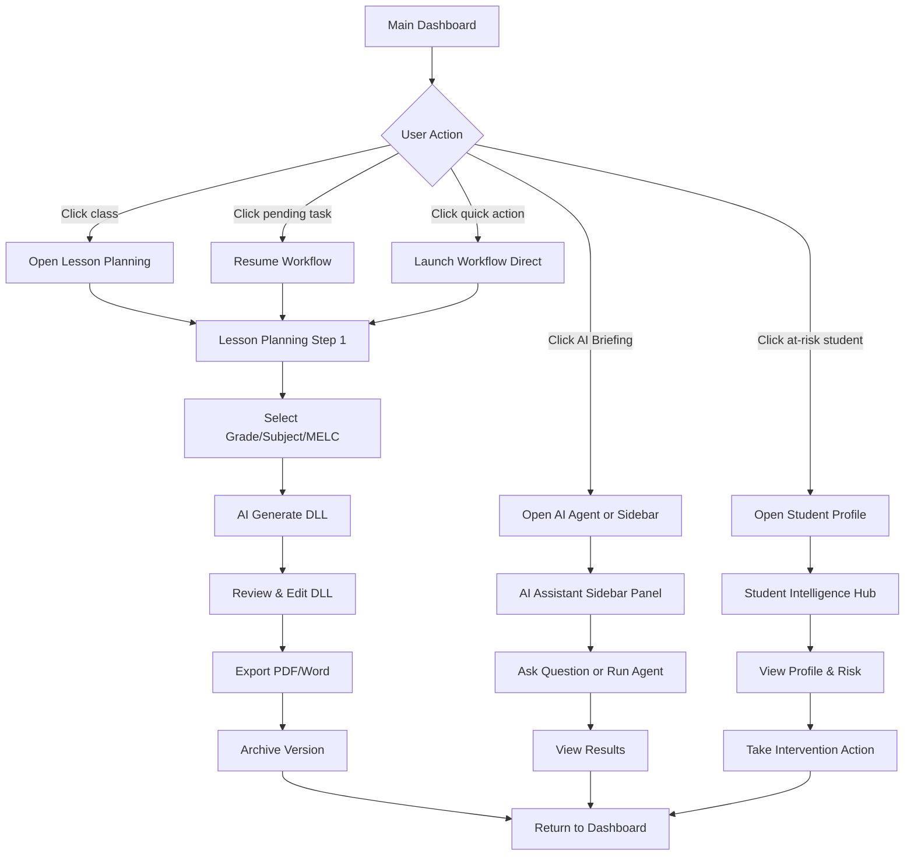

## Flow 3: Complete Grading Cycle (End-to-End)

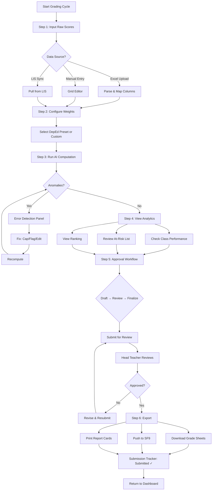

## Flow 4: School Forms Pipeline (SF1-SF10)

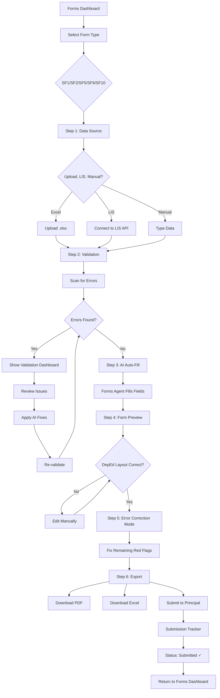

## Flow 5: Student Intelligence Hub → Intervention

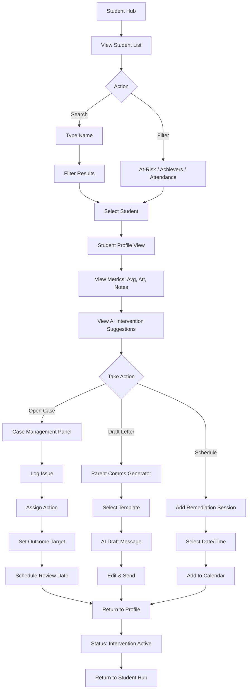

## Flow 6: Parent Communication Workflow

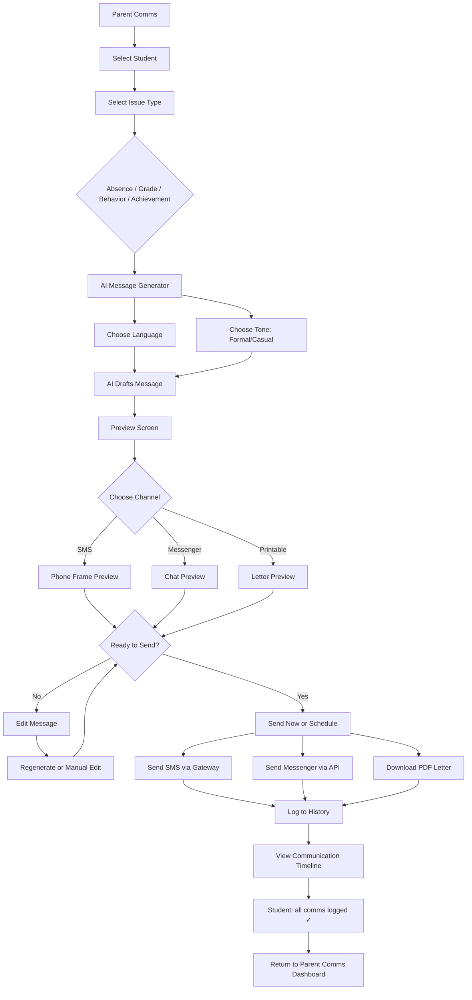

## Flow 7: Reports & Compliance Pipeline

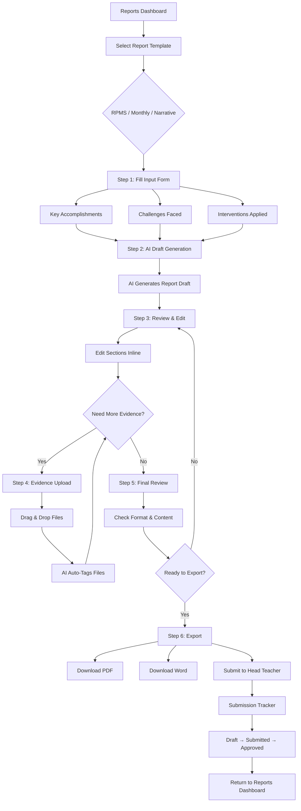

## Flow 8: School Programs (Feeding/DRRM/Brigada)

```mermaid
flowchart TD
    A[Programs Dashboard] --> B[Select Program]
    B --> C{Feeding / DRRM / Brigada}
    
    C --> D[Program Status Overview]
    D --> E{Current Status}
    
    E -->|Planning| F[Step 1: Program Setup]
    F --> G[Define Objectives]
    G --> H[Set Target Beneficiaries]
    H --> I[Identify Risks]
    
    I --> J[Step 2: Create Timeline]
    J --> K[Gantt Chart Editor]
    K --> L[Add Tasks & Milestones]
    L --> M[Assign Owners & Dates]
    
    M --> N[Step 3: Budget Planning]
    N --> O[Add Line Items]
    O --> P[Auto-Calculate vs MOOE]
    P --> Q[Flag Over/Under Budget]
    
    Q --> R[Step 4: Execution Phase]
    R --> S[Log Daily Activities]
    S --> T[Upload Photos & Headcount]
    T --> U[Track Progress vs Timeline]
    
    U --> V[Step 5: Generate Report]
    V --> W[AI Drafts Post-Activity Report]
    W --> X[Review & Edit]
    X --> Y[Export PDF]
    
    Y --> Z[Mark Program Complete]
    Z --> AA[Return to Programs Dashboard]
```

## Flow 9: Global AI Assistant Interaction

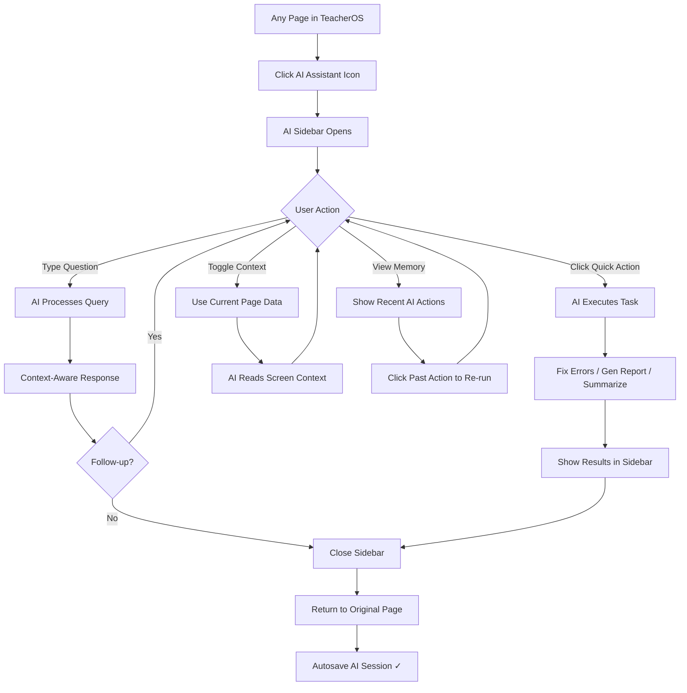

## Flow 10: Cross-Module Data Movement

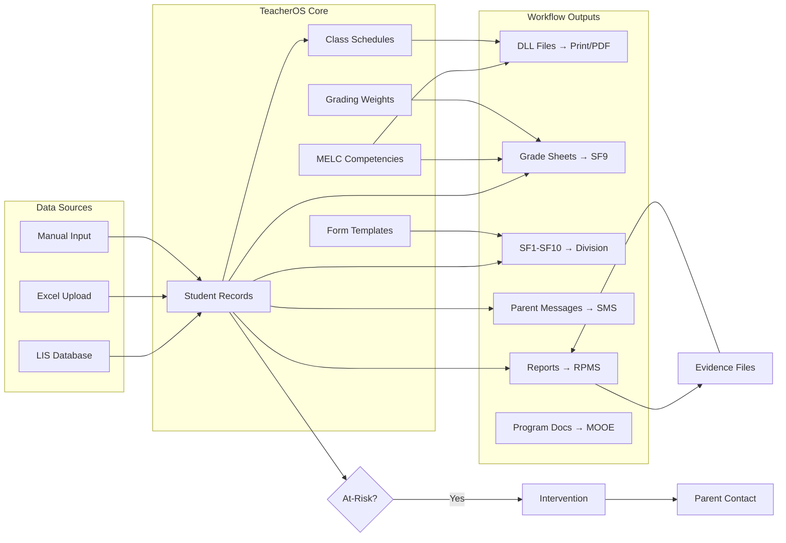

## Global Navigation State Machine

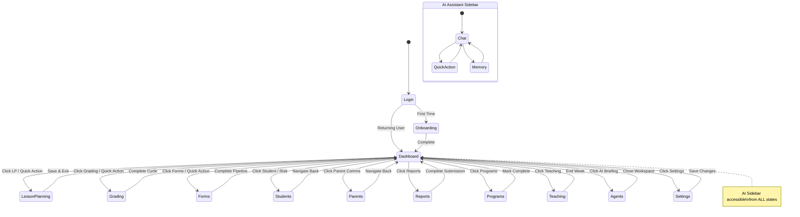

## Key Flow Principles

1. **Every workflow follows**: Input → AI Processing → Review → Edit → Export → Track
2. **Undo is always available**: Every step saves automatically
3. **AI is persistent**: The sidebar follows the user across all states
4. **No dead ends**: Every screen has a "Back to Dashboard" path
5. **Progressive disclosure**: Complex workflows reveal steps one at a time